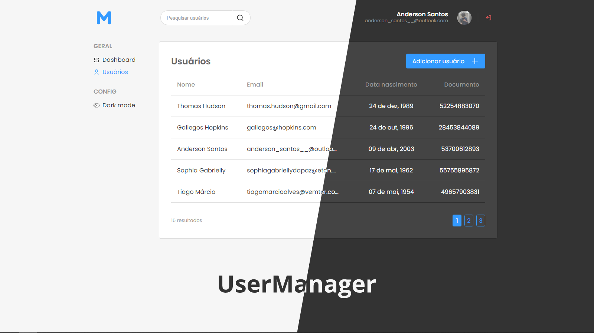

<h1 align="center" >User Manager</h1>


---

## ℹ Sobre

O UserManager é um projeto de desafio passado pela Softplan, tem como objetivo testar as habilidades de desenvolvimento de front end, além de visar um código limpo e fácilmente entendivel, tendo isso como base, chegamos ao user manager, uma ferramenta para gerenciamento de usuários, com sistema de autenticação e permissões.

## 💻 Tecnologias

Dentre as tecnologias utulizadas nesse projetos temos:
- ReactJs
- NextJs
- Typescript
- Styled-components
- JSON-Server
- Jest

### 🛠 ReactJs

O ReactJS é uma framework em javascript que apresentou ao mercado de desenvolvimento o conceito de JSX (JavaScript XML) que é basicamente a utilização de tags dentro do javascript, ou seja, trechos html sendo interpretado pelo javascript. Nesse caso o React é a base do projeto, todos os sistemas são feitos a partir dele.

### 🛠 NextJs

O NextJS é uma framework do ReactJS, que eleva a utilização do React a outro nível. O Next ficou popular por conta das funcionalidades diversas que ele traz ao React, como por exemplo:
- SPA (Single page application)
- SSR (Server Side Rendering)
- Pages routes
- Dynamic routes
- API routes
- Static Pages Generation
- tratamento de imagens
- etc...

Além disso o Next possuí um Back end intermediario que é responsável pela renderização das telas em server side, retornando para o usuário final uma página estática completamente tratada, o que não limita o usuário à utilização do Javascript no browser. E é nesse servidor aonde os endpoints desenvolvidos dentro da pasta api (do api routes) são executadas, deixando as requisições do front-end mais seguras e eficiêntes.

Nesse projeto utilizamos as principais tecnologias:
- SPA para ter mais desempenho e fluidez na navegação
- Pages routes para agilizar a manipulação de rotas de navegação
- Dynamic routes para tonar o gerenciamento de informações mais transparente para o usuário

### 🔧 Typescript

O Typescript é uma ferramenta de tipagem feita pela microsoft, desenvolvida com o objetivo de esclarecer o código e prever erros que aconteceriam por conta da tipagem dinâmica presente no Javascript atualmente, além disso o Typescript também trás uma vizualização clara do código para desenvolvedores multiplos. Nesse projeto o Typescript está sendo utilizado com um método de boas práticas e para organização e clareza do código.

### 💅 Styled-components

O Styled-components é um pré processador de CSS que utiliza o conceito de CSS in Javascript, ou seja, CSS sendo interpretado pelo javascript, esse conceito trás muitos beneficios referentes a estilização da aplicação, nos permitindo por exemplo executar funções e resgatar valores javascript dentro das configurações do CSS, além disso o Styled-components tem o seu próprio provedor de Tema, o que facilita na hora de criar um tema alternativo para o aplicação (dark mode por exemplo). O Styled-components também trás algumas usualidades inventadas pelo SASS(outro pré-processador CSS), como o encascatamento de estilos. Nesse projeto o styled-components está sendo utilizado para a estilização geral da aplicação e para a manipulação de temas (DARK e LIGHT).

### 📄 JSON-Server

O JSON-Server é uma ferramenta criada para imitar a comunicação
do cliente com um servidor, gerando assim um back-end fictício, aonde o front-end pode testar funcionalidades gerais. Nesse projeto o JSON-Server está sendo utilizado para imitar um CRUD de usuários do sistema de gerenciamento dos mesmos.

### 👷‍♂️ Jest

O Jest é uma framework de teste para javascript, além de ser uma das ferramentas mais conhecidas de testes o Jest é muito fácil de ser utilizado, tanto em testes integrados, quanto end-to-end, e principalmente, os testes unitários. Nesse projeto o Jest é utilizado para fazer testes unitários de componentes, vizando prever o funcionamento geral e principalmente a renderização final do mesmo.


### ✍ Eslint + Prettier

O Eslint é uma ferramenta utilizada para padronizar a estrutura do código com base em estruturas ja existentes consideradas por muitos eficiêntes, além disso o eslint trás algumas regras para a codificação, como por exemplo abolir a prática de criar funções vazias, prevê também alguns erros que podem ocorrer por falta de informação ou pela própria estrutura do código. Junto do eslint está o Prettier que é uma ferramenta utilizada para deixar o código mais amigável, aplicanto quebras de linhas automáticas, formas mais simples de estruturar o código, e formatação de estruturas de códigos para uma melhor vizualização, o eslint e o prettier junto do typescript fazem com que o código fique bem padronizado e bem estruturado, facilitando a vizualização e entendimento dos desenvolvedores.

## Utilização do projeto

### 📁 Adquirir o projeto

Para começarmos precisamos de uma versão do projeto userManager, que pode ser adquirido da seguinte forma:

```
$ git clone https://github.com/AndersonSantos0/user-manager.git
```

Após adquirir é necessário abrir a pasta do projeto pelo terminal ou pelo editor que está utilizando

### 🧰 Instalar dependências

Como a maioria dos projetos o userManager precisa de bibliotecas externas para funcionalidade total da aplicação e para adiquiri-las basta executar:

```
$ yarn
# ou
$ npm install
```

### 📀 Gerar uma versão funcional

O userManager ja está pronto, portanto não precisamos executa-lo em ambiente de desenvolvimento, por isso podemos gerar uma versão de build para ter a melhor experiência com a aplicação:

```
$ yarn build
# ou
$ npm run build
```

### 🔌 Iniciar a aplicação

Agora que temos tudo pronto basta iniciar a aplicação, só lembrando que o userManager utiliza o json-server portanto ele precisa que o servidor esteja disponível para que possa utilizar o sistema de gerenciamento e autenticação:

```
# com yarn
$ yarn server
$ yarn start

# com npm
$ npm run server
$ npm start
```

# Considerações

## 👨‍💻 Desenvolvimento

### Requisitos exigidos:

- ✓ A aplicação deverá estar protegida por login e senha
- ✓ Deverá existir 2 tipos de perfis (ADMIN e USER)
- ✓ Deverá possuir interface para pesquisa dos usuários cadastrados
- ✓ Deverá possuir interface para cadastro (CRUD) dos usuários da aplicação
- ✓ Deverá possuir interface para visualizar “Meu perfil”, podendo alterar a senha
- ✓ Deverá possuir a opção de “Sair” da aplicação
- ✓ Deverá aparecer o nome e/ou foto do usuário no header da aplicação

### Regras de negócio exigidas:
- ✓ O usuário com acesso ADMIN poderá executar cadastro (CRUD) de outros usuários e visualizar
- ✓ O usuário com acesso USER poderá apenas visualizar os usuários do sistema

### Requisitos não funcionais exigidos:

- ✓ O frontend deverá ser desenvolvido em React;
- ✓ Utilizar algum mock http, exemplo: json-server;
- ✗ Utilizar algum framework UI (Material-UI, Bootstrap, AntDesign, etc…);

### PLUS:

- ✓ Testes unitários;
- ✓ Usuário possuir foto no seu cadastro;

### Estrutura de usuário recomendada:

```
{
  "id": 1,
  "firstName": "Thomas",
  "lastName": "Hudson",
  "birthDate": "1989-12-24",
  "email": "thomas.hudson@gmail.com",
  "document": "52254883070",
  "password": "MTIzNDU2",
  "role": "ADMIN",      
}
```

### Estrutura de usuário final:
```
{
  "id": 1,
  "firstName": "Thomas",
  "image": BASE_64
  "lastName": "Hudson",
  "birthDate": "24-12-1989",
  "email": "thomas.hudson@gmail.com",
  "document": "52254883070",
  "password": "MTIzNDU2",
  "role": "ADMIN",      
}
```
---

### 💪 Funcionalidades extras:

- dark mode
- tratamento de rotas inexistentes (404)
- tratamento de erros internos (500) (caso o json-server não seja executado com a aplicação)
- paginação dos usuários e pesquisa feitas com getServerSideProps + Dynamic routes
- pagina de perfil de usuário feita com getServerSideProps + Dynamic routes
- SPA

### 👎 Requisito não concluido:

- Utilizar algum framework UI

Motivo: não possúo experiência com framework UI's, portanto priorizei os outros requisitos exigidos levando em consideração o tempo limite de uma semana, tomei essa decisão também pelo fato desse projeto ser um metodo de avaliação das minhas habilidades, portanto utilizar CSS "puro" parece ser uma boa forma de demonstrar o o meu nivel de conhecimento em práticas de estilização.

### 🦾 Regra de negócios extra:

- usuários "ADMIN" não podem editar/deletar informações de outros usuários "ADMIN"
- após editar as próprias informações o usuário é deslogado

## Implementações que não fiz + motivos

### 📡 API routes

Eu pretendia utilizar o API routes do next para fazer as principais requisições do sistema (criar, deletar e editar o usuário), com isso o usuário não poderia vizualiar as validações no front-end e burlá-las de alguma forma, exemplo:

Antes de editar ou criar um usuário eu verifico no json-server se as informações "Document" e "Email" já foram cadastradas, caso sim uma mensagem é apresentada, informando a necessidade de mudar essas informações.

Nesse exemplo são feitas 3 requisições para o json-server:

- Verificar se o Documento já está cadastrado
- Verificar se o email já está cadastrado
- Atualizar as informações do usuário

Com o uso da API routes essas requisições cairiam para 1, requisição essa que seria feita para a rota /api, e nessa rota todas essas validações de DataBase seriam executadas de maneira não visiveis ao usuário.

Motivo da não implementação: Priorização das funcionalidades. Apesar de não estar utilizando a API routes do next, esta funcionalidade está 100%, portanto ao invés de focar em melhora-la eu foquei em desenvolver as implementações restantes, e por conta da falta de tempo não foi possível abordar o aprimoramento desta funcionalidade.

### 📊 Dashboard

Hoje a aplicação posuí as seguintes rotas:

- Dashboard ('/')
- Usuários ('/users')
- criar usuário ('/users/create')
- editar usuário ('/users/edit/[id]')
- perfil ('/users/profile/[id]')
- 404 error
- 500 error

Atualmente a rota de usuários está bem rica em conteúdo, principalmente se comparada com a rota dashboard, que atualmente não possúi nenhuma informação interessante. minha ideia era que a dashboard resumisse as informações mais importantes do sistema referente aos usuários, porém não foi possível enriquecer essa tela.

Motivo: Não consegui imaginar uma maneira eficiênte e ao mesmo tempo bonita de apresentar informações na tela, pois tinha limitações como, diversidade de informações, e a falta de informações importantes apresentaveis.

## 👋 Considerações finais

Foi uma boa experiência desenvolver esse projeto, pois foi algo na qual nunca imaginei fazer em um projeto pessoal, além disso me proporcionou experiências diversas em relação as tecnologias utilizadas como Jest, na qual não tenho muita experiência e o json-server que eu nunca tinha utilizado antes. Agradeço pela oportunidade e pela simpatia oferecidas pela equipe de RH, e agradeço a equipe que desenvolveu esse desafio por me proporcionar novas experiências em um projeto com requisitos e objetivos.
